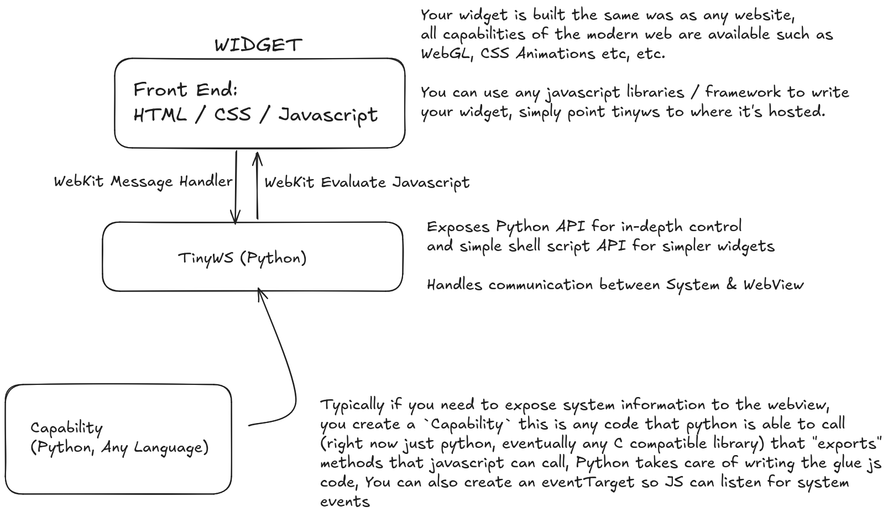

# Tiny Widget System
This is a small widget system that works by being just a thin layer between Webkit2Gtk and your system,
Allowing you to easily script webpages to behave as your widgets,

For a basic example of what the code looks like for the user, consult the `examples` directory

## Requirements
- Python3
- Webkit2GTK
- GTK 3
- Python - Xlib
- Python - psutil

## Structure

## API
Potentially out of date, for the most accurate version you'd have to read the source code :(

## Parameters (Passed to constructor)
- inspect - Show the webpage inspector on startup (Recommended for debug)
- transparent - Make the window transparent
- html - HTML document as a string
- forward_console - Write DOM console.log() messages to STDOUT (Recommended for debug) 
- window_css - GTK CSS to apply to the window
- decorated - Decorate (Add titlebar) to GTK Window
- exit_on_window_close - "
- title - Set title text
- visible - Is window visible or not (default: True)
- url - Can be used instead of `html`
- window_type - [Gdk Window Type Hint](https://docs.gtk.org/gdk3/enum.WindowTypeHint.html)

In case you need to tweak these after `webview.run()`, please refer to source code and modify, It usually corresponds to a single function call, eventually this design might be modified 

## Capabilities
Must extend from `Capability`, see the `src/tinyws/capabilities/sysinfo.py` example,

If emits events, should extend `EventCapability`

Can be accessed from javascript by `window.capabilities.CAPABILITY_NAME.METHOD_NAME`

## Roadmap
- Allow capabilities to be written in any language (C ABI interface)
- Provide some builtin capabilites besides system info
